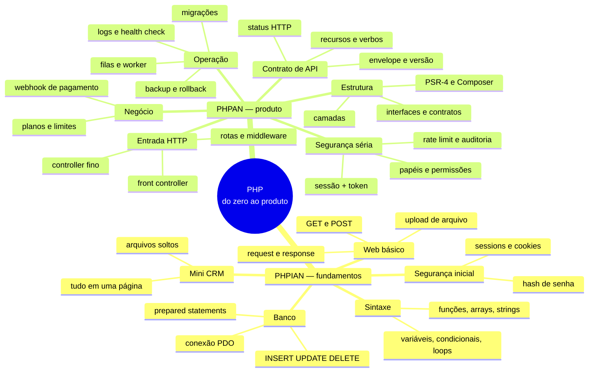
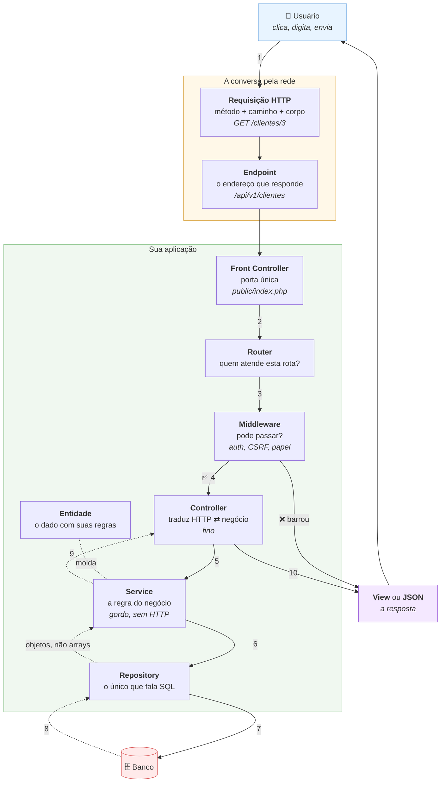
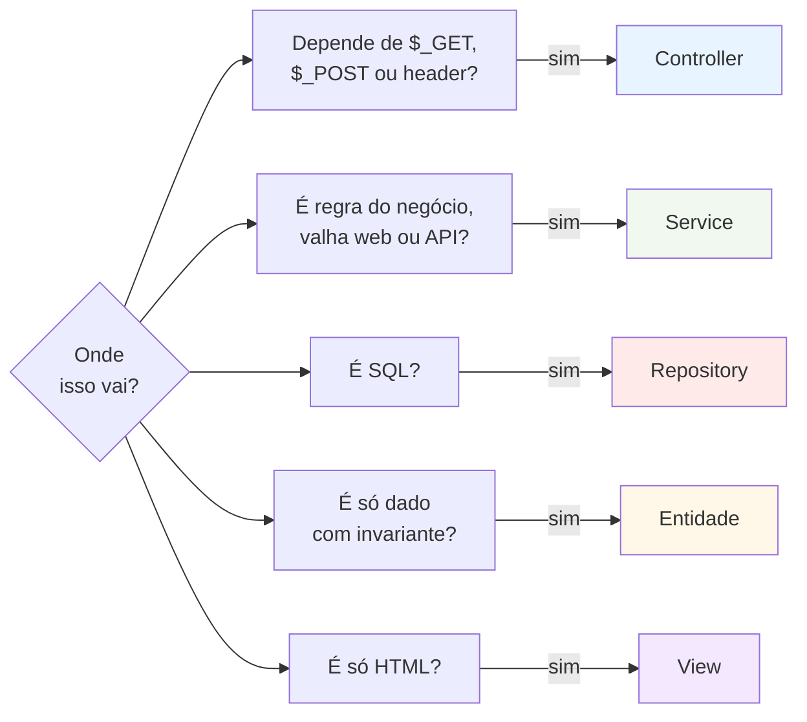
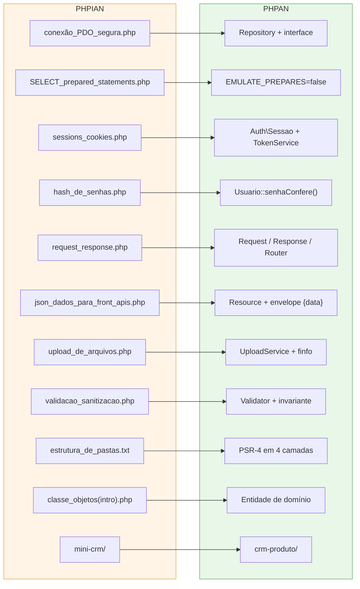
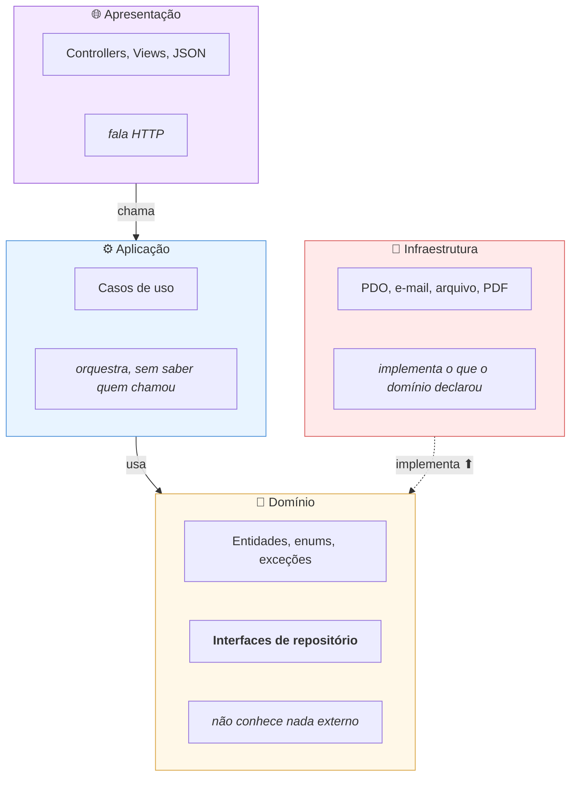
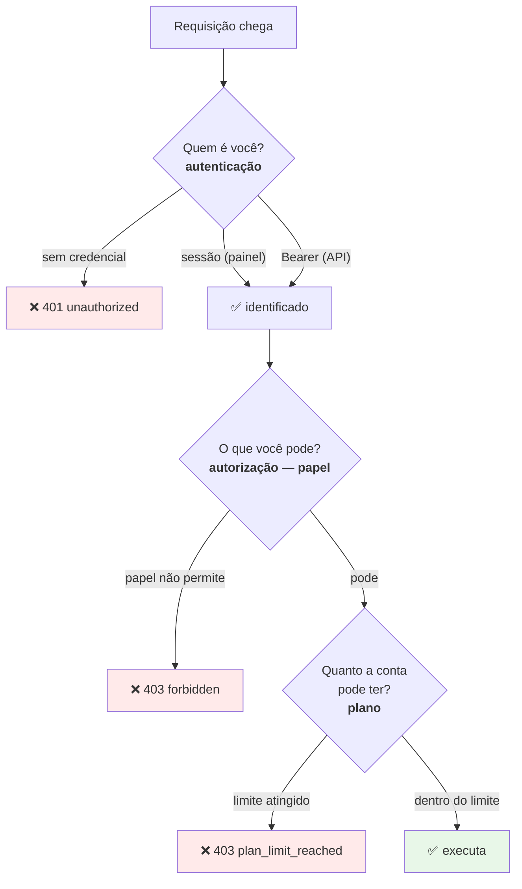
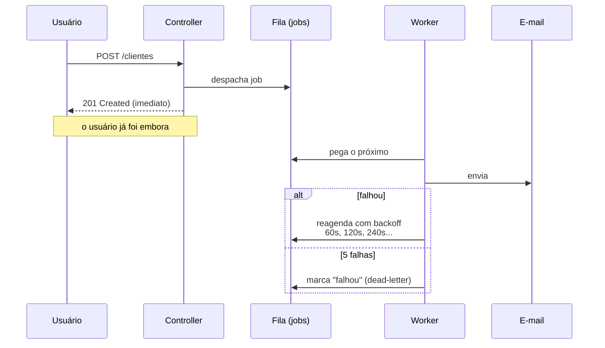
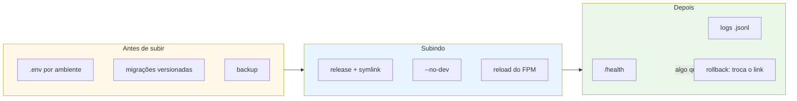
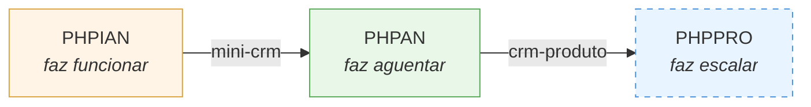

# Síntese: do PHPIAN ao PHPAN

Um mapa do que foi aprendido nos dois cursos, e — mais importante — **onde cada
coisa do PHPIAN reaparece transformada no PHPAN**.

A ideia central é uma só:

> No PHPIAN você aprendeu a **fazer funcionar**.
> No PHPAN você aprendeu a **fazer aguentar** — mudança, usuário, tempo e outra pessoa mexendo.

---

## 1. O mapa inteiro

---

## 2. A escada de conceitos

Do que o usuário clica até onde o dado descansa. Cada degrau existe para responder
**uma** pergunta.

### O que é cada coisa, em uma frase

| Termo | O que é | No projeto |
|---|---|---|
| **API** | um contrato para programas conversarem entre si — sem tela, só dados | `/api/v1` |
| **Endpoint** | um endereço específico dessa API | `POST /api/v1/clientes` |
| **Rota** | a regra que liga endereço + método a um código seu | `routes/api.php` |
| **Front Controller** | a porta única por onde toda requisição entra | `public/index.php` |
| **Router** | quem lê a rota e escolhe o controller | `src/Http/Router.php` |
| **Middleware** | filtro que roda **antes** e pode barrar | `AuthMiddleware`, `CsrfMiddleware` |
| **Controller** | traduz HTTP para chamada de negócio e vice-versa | `ClienteController` |
| **Service** | a regra do negócio, sem saber que HTTP existe | `ClienteService` |
| **Repository** | a única camada que sabe SQL | `RepositorioDeClientesPdo` |
| **Entidade** | o dado com as regras que sempre valem | `Cliente` |
| **View** | só apresentação, com escape obrigatório | `views/clientes/index.php` |

### A pergunta que decide a camada

> **O teste definitivo do Service:** *a regra sobrevive se a chamada vier de um cron?*
> Se sim, é Service. Se ela precisa de `$_POST` para existir, é Controller.

---

## 3. A interseção: cada arquivo do PHPIAN tem um endereço no PHPAN

Este é o coração da síntese. Nada do que você aprendeu foi jogado fora — **tudo virou
outra coisa, maior**.

### O mesmo problema, as duas respostas

| Situação | PHPIAN | PHPAN | Por que mudou |
|---|---|---|---|
| Buscar cliente | `$pdo->query()` na página | `RepositorioDeClientes` (interface) | trocar de banco não deve mexer na regra |
| Evitar injeção | `prepare()` | `prepare()` + `EMULATE_PREPARES=false` | quem prepara passa a ser o banco |
| Login | `$_SESSION['id'] = 1` | sessão endurecida + `session_regenerate_id` | session fixation |
| API | `echo json_encode($linhas)` | `Resource` + envelope + status | contrato estável para quem integra |
| Formulário | `if ($_POST['nome'] == '')` | `Validator` + invariante na entidade | a regra vale nos dois pontos de entrada |
| Upload | conferir extensão | `finfo` no conteúdo + nome novo + fora de `public/` | extensão é escolhida pelo atacante |
| Erro | `die('erro')` | exceção de domínio + status HTTP | `die()` derruba a API inteira |
| Organização | `include 'header.php'` | PSR-4 + camadas | achar onde uma regra mora |
| Excluir | `DELETE FROM` | soft delete + lixeira + auditoria | o usuário vai clicar errado |

---

## 4. As quatro camadas, e a regra da seta

**A seta da infraestrutura aponta para cima.** É o que permite trocar arquivo por MySQL
sem que domínio, service ou controller percebam — e foi cobrado na prática: quando o
banco entrou, a troca foi **uma linha** no `Container`.

---

## 5. Autenticação e autorização: perguntas diferentes

Três perguntas independentes, três respostas diferentes. Confundi-las é o erro comum:
`401` faz o cliente tentar renovar o token — inútil quando o problema era permissão.

| Conceito | Pergunta | Onde vive |
|---|---|---|
| **Autenticação** | quem é você? | `Sessao`, `TokenService` |
| **Autorização (papel)** | o que **você** pode fazer? | `Gate` |
| **Plano** | quanto a **conta** pode ter? | `PlanLimiter` |

---

## 6. O que roda fora da requisição

Nem tudo acontece enquanto o usuário espera.

O mesmo padrão serve para lembretes (cron despacha, worker envia) e para exportações
grandes (acima de 1000 registros vira job).

---

## 7. Produção: o que ninguém vê e todo mundo sente

**A lição mais dura:** backup sem restauração testada é crença, não backup. O RTO real
deste projeto — **1 segundo** — foi medido restaurando de verdade, não estimado.

---

## 8. Onde estudar cada coisa

| Quero entender | Rodar | Ler |
|---|---|---|
| camadas e o ciclo HTTP | `php PHPAN/Modulo_3/01-ciclo-http-camadas.php` | `.md` ao lado |
| rota, controller, middleware | `Modulo_3/02` e `Modulo_3/06` | idem |
| o que é API na prática | `Modulo_4/01-recursos-verbos-status.php` | idem |
| contrato JSON e mass assignment | `Modulo_4/02-json-contratos.php` | idem |
| token, papéis, auditoria | `Modulo_5/02`, `05/03`, `05/06` | idem |
| fila, logs, upload | `Modulo_6/01`, `06/02`, `06/03` | idem |
| migrações e backup | `Modulo_7/02` e `07/05` | idem |
| planos e webhook | `Modulo_8/01` e `08/02` | idem |

Cada aula é um arquivo que **roda e se verifica**: imprime o que está checando e falha
se o projeto divergir.

---

## 9. As sete lições que sobrevivem a qualquer linguagem

1. **Uma regra, um lugar.** Se ela existe em dois arquivos, um deles vai ficar
   desatualizado — e ninguém vai perceber.
2. **Fail closed.** Sem plano, o limite é zero, não infinito. Ação desconhecida no
   `Gate` nega. O padrão seguro é negar.
3. **Não confie no cliente.** Nome de arquivo, extensão, `Content-Type`, campo do JSON,
   token — tudo vem de fora e tudo é forjável.
4. **Verifique comportamento, não código.** Escrevi um teste que lia o código e passava
   com o limite de plano **desligado**. Só criar acima do teto provou que funcionava.
5. **Falhe cedo e alto.** Config ausente derruba no boot, com o nome da variável — não
   na primeira query, 40 minutos depois.
6. **O que não foi executado não está feito.** Serviço pronto sem rota é código que o
   usuário nunca alcança.
7. **Escreva o que ficou de fora.** Pendência com motivo é roadmap; pendência silenciosa
   é dívida que ninguém lembra.

---

## 10. Fechamento

O `mini-crm` do PHPIAN continua intocado como registro do ponto de partida. O
`crm-produto` é o mesmo domínio depois de atravessar 8 módulos.

**Estado:** 47 aulas executáveis · projeto com 137 testes e 320 asserções ·
`composer quality` verde (estilo, PHPStan level 5, testes, auditoria de dependências).

Pendências honestas em [`PHPAN/crm-produto/docs/rubrica-final.md`](PHPAN/crm-produto/docs/rubrica-final.md) —
todas por falta de servidor, nenhuma por falta de entendimento.
